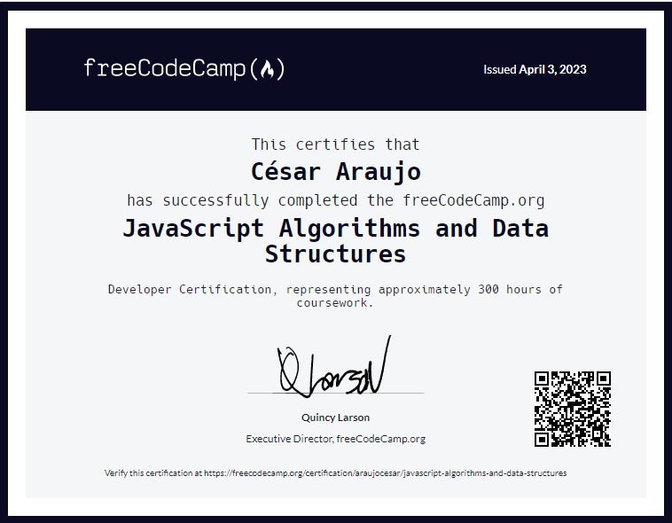

# Hi👋! I'm César Araujo.

I'm a frontend web developer in formation. I have experience in responsive web design and data structure management.

## Technical skills

- HTML5 
- CSS 
  - SASS 
  - PostCSS 
- Tailwind 
- Bootstrap 
- JavaScript 
- React 

## Certifications

- [Responsive Web Design Certification](https://freecodecamp.org/certification/araujocesar/responsive-web-design)

  

###

- [JavaScript Algorithms and Data Structures](https://www.freecodecamp.org/certification/araujocesar/javascript-algorithms-and-data-structures)

  

## Portafolio Projects
### - Card validation form: HTML5 , CSS , SASS  and JavaScript . 
&nbsp;&nbsp;&nbsp;&nbsp; [Live preview](https://project-form-validation-frontend.vercel.app/) and [Repository](https://github.com/araujocesarr/interactive-card-form-validation).

### - Meme generator: Tailwind  and React.
&nbsp;&nbsp;&nbsp;&nbsp; [Live preview](https://meme-generator-henna-beta.vercel.app/) and [Repository](https://github.com/araujocesarr/meme-generator).

## Contact

- Email: [cesararaujo.perez@gmail.com](mailto:cesararaujo.perez@gmail.com)
- Fiverr: [@araujo\_](https://www.fiverr.com/araujo_)
- Upwork: [César Araujo](https://www.upwork.com/freelancers/~0131c3e9d8794f3c24)
